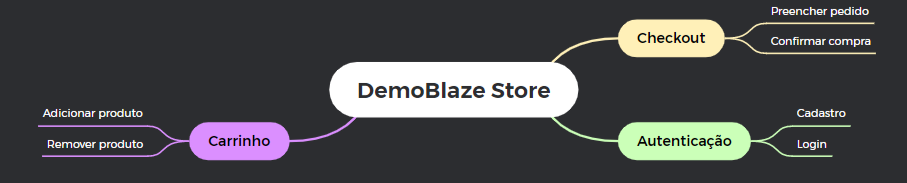

# Desafio Técnico QA - Easysecrets

Este repositório contém os testes automatizados para a aplicação **DemoBlaze** (`https://www.demoblaze.com`) utilizada no desafio técnico.

O projeto foi desenvolvido com **Playwright + TypeScript**, estruturado com **Page Object Model (POM)** e com implementação de **BDD** utilizando **Gherkin/Cucumber** através do `playwright-bdd`.

---

### Objetivo do Projeto

Automatizar os seguintes fluxos da aplicação:

- Cadastro de usuário
- Login
- Adição de produto ao carrinho
- Remoção de produto do carrinho

Como diferencial, também foi implementado o fluxo de:

- Finalização de compra

---

### Mapa Mental dos Fluxos de Teste



---

### Estrutura do Projeto

```text
DESAFIOTECNICO-EASYSECRETS/
├── assets/                     # Arquivos visuais de apoio (ex.: mapa mental)
├── features/                   # Cenários BDD escritos em Gherkin
│   ├── adicionar_produto.feature
│   ├── cadastro.feature
│   ├── finalizar_compra.feature
│   ├── login.feature
│   └── remover_produto.feature
├── pages/                      # Camada Page Objects (POM)
│   ├── CadastroPage.ts
│   ├── CarrinhoPage.ts
│   ├── HomePage.ts
│   ├── LoginPage.ts
│   └── ProdutoPage.ts
├── steps/                      # Step definitions do BDD
│   ├── cadastro.steps.ts
│   ├── carrinho.steps.ts
│   ├── login.steps.ts
│   └── produto.steps.ts
├── tests/                      # Testes em Playwright puro
│   ├── adicionar_produto.spec.ts
│   ├── cadastro.spec.ts
│   ├── finalizar_compra.spec.ts
│   ├── login.spec.ts
│   └── remover_produto.spec.ts
├── package.json
├── package-lock.json
├── playwright.config.ts
└── README.md
````

> **Observação:**
> A suíte principal pode ser executada via BDD com geração automática dos testes.
>
> A pasta `tests/` possui implementação em Playwright puro.

---

## Tecnologias Utilizadas

* Playwright
* TypeScript
* playwright-bdd
* Gherkin / Cucumber

---

## Boas Práticas Aplicadas

* Page Object Model (POM)
* Separação do projeto em camadas
* Reutilização de código
* Asserções objetivas
* Massa de dados dinâmica
* Cuidados com estabilidade da aplicação
* Legibilidade e manutenção dos testes

---
## Instruções para Rodar o Projeto

### Pré-requisitos
- **Node.js** (versão 18 ou superior)

### 1. Clonar o repositório
```bash
git clone https://github.com/silveirabrenda/DesafioTecnico-Easysecrets.git
cd DESAFIOTECNICO-EASYSECRETS
```

### 2. Instalar as dependências
```bash
npm install
```

### 3. Instalar os navegadores do Playwright
```bash
npx playwright install chromium
```
### 4. Gerar os testes BDD e executar a suíte
O projeto utiliza **BDD com Gherkin** via `playwright-bdd`.  
Por isso, antes da execução, os testes precisam ser gerados a partir dos arquivos `.feature` e depois executados com Playwright.

#### Windows PowerShell
```bash
npx playwright-bdd gen; npx playwright test
```

#### Git Bash / CMD / terminais que aceitam `&&`
```bash
npx playwright-bdd gen && npx playwright test
```

### 5. Visualizar o relatório de testes
Após a execução, abra o relatório HTML gerado pelo Playwright:

```bash
npx playwright show-report
```

 ---

## Decisões Técnicas

### 1. BDD como diferencial

Foi utilizada a biblioteca `playwright-bdd` para permitir a escrita dos cenários em Gherkin, tornando os testes mais legíveis e próximos da linguagem de negócio.

---

### 2. Page Object Model (POM)

A camada `pages/` concentra os elementos e ações da interface, reduzindo duplicidade e facilitando manutenção.

---

### 3. Separação de responsabilidades

* `features/`: descreve o comportamento esperado
* `steps/`: faz a ponte entre Gherkin e automação
* `pages/`: encapsula interações com a aplicação
* `tests/`: Playwright puro

---

### 4. Estabilidade da suíte

Como o site DemoBlaze pode apresentar oscilações, foram aplicadas estratégias como:

* `workers: 1`
* `retries: 1`
* Uso de esperas explícitas
* Tratamento de alertas e modais
* Dados dinâmicos para evitar conflitos entre execuções

---

## Fluxos Automatizados

### Obrigatórios

✅ Cadastro de usuário

✅ Login

✅ Adicionar produto ao carrinho

✅ Remover produto do carrinho

### Diferencial implementado

✅ Finalizar compra

---